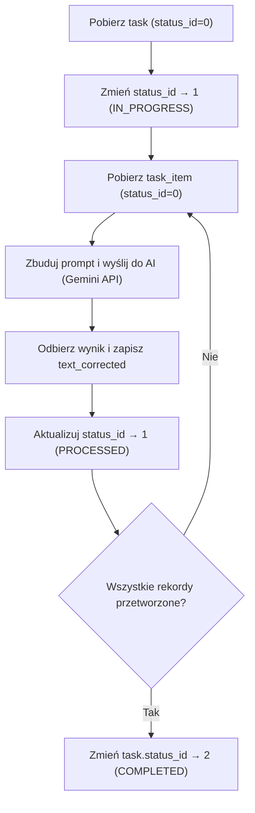

rojektu

**AI Worker** to niezależna usługa backendowa odpowiedzialna za realizację logiki biznesowej systemu korekty i tłumaczeń tekstów.  

Jej głównym zadaniem jest **automatyczne przetwarzanie danych tekstowych** zapisanych w lokalnej bazie, poprzez połączenie z modelem sztucznej inteligencji (np. **Gemini API** lub **GPT-5**) i zapisanie wyników w bazie danych.

Worker wywoływany w CLI za pomoc cron lub z aplikacji www.

---
## Zakres funkcjonalny

Usługa odpowiada za:

1. Pobieranie zadań (`task`) i elementów (`task_item`) ze statusem „do przetworzenia”.
2. Komunikację z wybranym modelem AI poprzez API.
3. Przetwarzanie tekstu (np. korekta, tłumaczenie, analiza).
4. Zapis wyników i aktualizację statusów w bazie.
5. Obsługę błędów, raportowanie i logowanie postępu.

Cały proces jest w pełni odseparowany od interfejsu webowego (Yii2), co zapewnia bezpieczeństwo i skalowalność systemu.

Procesy uruchamiane przez cron lun na żądanie użytkownika

Wymagania projektu :
- nie używaj  sqlalchemy szybkie zapytania SQL jawne zgodne z MySQL
- **czysty MySQL (PyMySQL)** - bez SQLAlchemy
- zrobić własną prostą klasę do MySQL (połącznie init, query, execute, close)
- gotowy do uruchomienia z CMD lub PowerShell jako CLI
- `CLI` z parametrami `--task`, `--task-item`, `--max-item`, `--dry-run`
- `FastAPI` z endpointem `/task/run`
- plik `.env` z konfiguracją MySQL i innymi stalymi
- przygotowany pod przyszłe kolejki Celery,  
- z pełną strukturą i zawartością plików.
- `requirements.txt`, `README.txt` (dla Windows) i `DB_Description.txt`.

Przykład
```
import pymysql
from app.config import settings

class MySQLDatabase:
    """Prosty klient MySQL bez ORM, tylko czyste SQL."""
    def __init__(self):
        self.conn = pymysql.connect(
            host='localhost',
            user='root',
            password='root',
            database='ai_worker',
            charset='utf8mb4',
            cursorclass=pymysql.cursors.DictCursor
        )

    def query(self, sql: str, params: tuple = ()):
        """Wykonuje zapytanie SELECT i zwraca wynik jako listę słowników."""
        with self.conn.cursor() as cursor:
            cursor.execute(sql, params)
            return cursor.fetchall()

    def execute(self, sql: str, params: tuple = ()):
        """Wykonuje INSERT/UPDATE/DELETE i zatwierdza transakcję."""
        with self.conn.cursor() as cursor:
            cursor.execute(sql, params)
        self.conn.commit()

    def close(self):
        self.conn.close()
```

---
## Parametry uruchomienia skryptu

| Parametr      | Opis                                          | Przykład                            |
| ------------- | --------------------------------------------- | ----------------------------------- |
| `--task`      | ID zadania (`id_task`)                        | `python worker.py --task 42`        |
| `--task-item` | ID pojedynczego rekordu (`id_task_item`)      | `python worker.py --task-item 1005` |
| `--max-item`  | Maksymalna liczba zadań przetwarzanych itemów | `--max-task 10`                     |
| `--dry-run`   | Tryb testowy bez zapisu do bazy               | `--dry-run`                         |

Jeśli nie podano parametrów, `--task-item` automatycznie pobiera **najstarsze aktywne zadania** (`status_id = 0`) i przetwarza je do wyczerpania limitu. Jeżeli podano `--task` pobiera najstarsze task_item dla danego task.


## Zalecany podział aplikacji 

Zalecany podział aplikacji  CLI + FastAPI, gotowy pod przyszłe kolejki (nie oprogramowuj routera na razie zostaw strukturę pod przyszły rozwój)

```
ai_worker/
├── app/
│   ├── api/
│   │   ├── router.py
│   │   └── routes_task.py
│   ├── db/
│   ├── ai/
│   ├── services/
│   ├── main.py
│   ├── config.py
│   └── __init__.py
├── cli/
│   └── worker_cli.py
├── .env
├── requirements.txt
├── README.txt
└── DB_Description.txt
```

Przepływ aplikacji :
main.py → worker.py → repository.py → ai.client.py → models.py

---

## Przepływ procesu przetwarzania

1. 🟢 **Pobranie zadania (`task`)**  
   - wybranie najstarszego najstarszego taska  statusem IN_PROGRESS lub NEW
   - pobrani danych modelu powiązanego z tasakiem
   - status zmienia się z `0 = NEW` → `1 = IN_PROGRESS`
   - konfiguracja polaczenia LLM (z tabeli `ai_model` na podstawie klucza `task.id_ai_model` ) w ramach modelu Gemmini

1. 🧩 **Budowa promptu**  
   - przykład:   „Popraw błędy ortograficzne i stylistyczne w poniższym tekście bez zmiany znaczenia.” Do tego będzie pobierał opis danych do przetworzenia z pola `task.desctiption`
   
3. 📦 **Pobranie rekordów (`task_item`)**  
   - status: `0 = PENDING`  
   - pobierane porcjami, np. po 10 rekordów (zgodnie z parametrami wywołania)

4. 🌐 **Wysłanie do modelu AI (Gemini API)**  
   - używany klucz z tabeli `ai_model.api_key_encrypted`

5. 📥 **Odbiór i zapis wyniku**  
   - `text_corrected` → zapis poprawionej wersji  
   - `change_summary` → opis zmian  
   - `tokens_input`, `tokens_output`
   - `status_id = 1 (PROCESSED)`

6. 🗃️ **Aktualizacja `task`**  
   - zwiększenie `records_processed`  
   - zapis `finished_at` po zakończeniu


7. ✅ **Zakończenie**  
   - jeśli wszystkie rekordy przetworzone → `status_id = 2 (COMPLETED)`  
   - w przypadku błędu → `status_id = 3 (ERROR)`


### Sekcje „Subprocesy” / Podzadania

Dodaj opis **mikrozadań (subtasks)**, które ClauCode może przekształcić w funkcje lub moduły:

| Nazwa podzadania            | Zakres                      | Funkcja docelowa / Moduł                  |
| --------------------------- | --------------------------- | ----------------------------------------- |
| `fetch_task()`              | Pobranie najstarszego taska | `db.task_repository.get_next()`           |
| `fetch_items(task_id)`      | Pobranie rekordów           | `db.task_item_repository.list_pending()`  |
| `build_prompt(task)`        | Zbudowanie promptu          | `ai.prompt_builder.build(task)`           |
| `send_to_ai(model, text)`   | Wywołanie API               | `ai.client.send()`                        |
| `save_result(item, result)` | Zapis wyniku do DB          | `db.task_item_repository.update_result()` |
| `update_task_status(task)`  | Uaktualnienie postępu       | `db.task_repository.update_progress()`    |


---
### Sekcje „Subprocesy” / Podzadania

Dodaj opis **mikrozadań (subtasks)**, które ClauCode może przekształcić w funkcje lub moduły:

|Nazwa podzadania|Zakres|Funkcja docelowa / Moduł|
|---|---|---|
|`fetch_task()`|Pobranie najstarszego taska|`db.task_repository.get_next()`|
|`fetch_items(task_id)`|Pobranie rekordów|`db.task_item_repository.list_pending()`|
|`build_prompt(task)`|Zbudowanie promptu|`ai.prompt_builder.build(task)`|
|`send_to_ai(model, text)`|Wywołanie API|`ai.client.send()`|
|`save_result(item, result)`|Zapis wyniku do DB|`db.task_item_repository.update_result()`|
|`update_task_status(task)`|Uaktualnienie postępu|`db.task_repository.update_progress()`|

---

## Struktura tabel (fragment DDL)

Plik [[DB tablice słownikowe]]

---

## Architektura techniczna

| Komponent         | Technologia                     | Opis                                           |
| ----------------- | ------------------------------- | ---------------------------------------------- |
| API serwisowe     | **FastAPI**                     | REST API do uruchamiania i monitorowania zadań |
| ~~Kolejka zadań~~ | ~~**Celery + Redis/RabbitMQ**~~ | ~~Asynchroniczne przetwarzanie rekordów~~      |
| Warstwa AI        | Gemini 2.5 Pro                  | Korekta, tłumaczenie lub analiza tekstu        |
| ORM / DB          | **SQLAlchemy + PyMySQL**        | Obsługa bazy lokalnej (`task`, `task_item`)    |
| Logowanie         | **Celery Flower / Prometheus**  | Monitoring postępu i stanu zadań               |

---

## Wydajność i optymalizacja

- Statusy przechowywane jako liczby (`TINYINT`) → szybkie filtrowanie i indeksowanie.  
- Obsługa błędów i ponownych prób (`retry`) w przypadku timeoutów.

---

## Przepływ danych (diagram)



---

## 0️⃣ Bezpieczeństwo

- Klucze API i dane logowania szyfrowane (`AES_ENCRYPT`, `VARBINARY`).
- Dane źródłowe nie są modyfikowane — przetwarzanie odbywa się tylko na lokalnych kopiach.
- Każda operacja ma własny identyfikator (`operation_uuid`).
- Dane osobowe nigdy nie są przekazywane do modelu AI.

---

## 1️⃣ Przykładowe logi przetwarzania

| Etap | Log systemowy |
|------|----------------|
| START | `[Task 42] Rozpoczęto przetwarzanie (15 rekordów)` |
| FETCH | `[Task 42] Pobrano 10 rekordów ze statusem 0 (pending)` |
| PROMPT | `[Gemini] Wysłano prompt: 280 znaków` |
| RESULT | `[TaskItem 1005] Otrzymano wynik, zapisano text_corrected` |
| DONE | `[Task 42] Przetwarzanie zakończone – 10/10 rekordów` |
| ERROR | `[Task 42] Błąd API: Timeout` |

---

## 2️⃣ Wyniki i integracja z frontendem

Po zakończeniu działania workera:
- wyniki są widoczne w panelu Yii2 (moduł `task_item`),
- użytkownik może zatwierdzać (`accepted`) lub odrzucać (`rejected`) wyniki,
- po zatwierdzeniu rekordów są eksportowane z powrotem do bazy źródłowej (`UPDATE`).

---

## 3️⃣ Podsumowanie

**AI Worker** to kluczowy komponent systemu do automatycznej korekty i tłumaczenia tekstów.  
Zapewnia:
- bezpieczne przetwarzanie w tle,  
- pełną kontrolę nad procesem,  
- wysoką wydajność dzięki statusom liczbowym i indeksowaniu,  
- łatwą integrację z frontendem i bazą danych.  

Dzięki architekturze **FastAPI + Celery + Redis** możliwe jest skalowanie systemu i równoległa obsługa tysięcy rekordów w jednym cyklu.

### Funcjonalności nie objete MVP:
- Worker docelowo będzie działał **asynchronicznie** i **równolegle** – może obsługiwać wiele zadań jednocześnie, dzięki architekturze **FastAPI + Celery + Redis/RabbitMQ**.
- brak szyfrowania kluczy API dla modeli LLM 